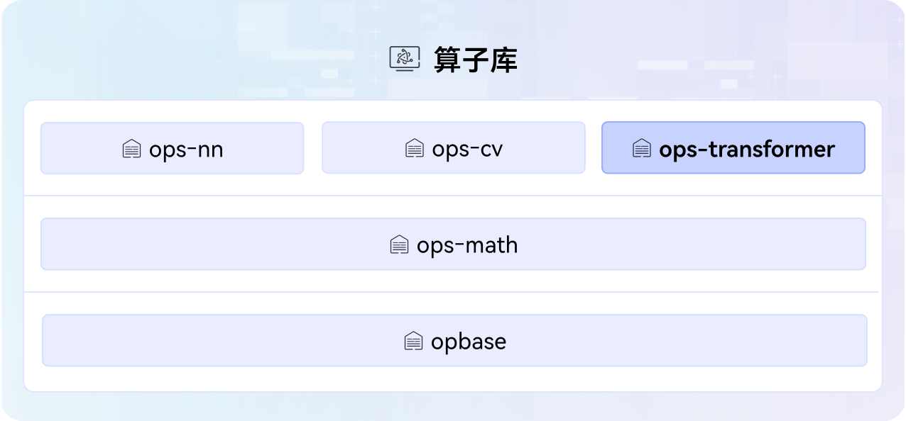

# ops-transformer

## 🔥Latest News

- [2025/09] ops-transformer项目首次上线。

## 🚀概述

ops-transformer是[CANN](https://hiascend.com/software/cann) （Compute Architecture for Neural Networks）算子库中提供transformer类大模型计算的进阶算子库，包括attention类、moe类等算子，算子库架构图如下：



## ⚡️快速入门

若您希望快速体验算子的调用和开发过程，请访问如下文档获取简易教程。

- [算子列表](docs/zh/op_list.md)：介绍项目提供的全量算子信息，方便快速查询。
- [环境部署](docs/zh/context/quick_install.md)：介绍项目基础环境的搭建，包括软件包和第三方依赖的获取和安装。
- [算子调用](docs/zh/invocation/quick_op_invocation.md)：环境部署后，介绍如何快速调用算子，包括编译执行算子包和UT等。
- [算子开发](docs/zh/develop/aicore_develop_guide.md)：环境部署后，介绍如何快速开发算子，包括创建算子工程、实现Tiling和Kernel核心交付件等。

## 📖学习教程

若您希望深入体验项目功能并修改算子源码，请访问如下文档获取详细教程。
- [算子调用方式](docs/zh/invocation/op_invocation.md)：介绍不同的调用算子方式，方便快速应用于不同的AI业务场景。
- [算子调试调优](docs/zh/debug/op_debug_prof.md)：介绍常见的算子调试和调优方法，如DumpTensor、msProf等。
- [算子基本概念](docs/zh/context/基本概念.md)：介绍算子领域相关术语和概念，如非连续Tensor、量化模式等。

## 🔍目录结构
关键目录如下，详细目录介绍参见[项目目录](./docs/zh/context/dir_structure.md)。
```
├── cmake                          # 项目工程编译目录
├── common                         # 项目公共头文件和公共源码
├── attention                      # attention类算子
│   ├── flash_attention_score      # flash_attention_score算子所有交付件
│   │   ├── CMakeLists.txt         # 算子编译配置文件
│   │   ├── docs                   # 算子说明文档
│   │   ├── examples               # 算子使用示例
│   │   ├── op_host                # 算子信息库、Tiling、InferShape相关实现目录
│   │   ├── op_kernel              # 算子Kernel目录
│   │   └── README.md              # 算子说明文档
│   ├── ...
│   └── CMakeLists.txt             # 算子编译配置文件
├── docs                           # 项目文档介绍（zh为中文，en为英文）
├── examples                       # 端到端算子开发和调用示例
├── experimental                   # 用户自定义算子存放目录
├── ...
├── moe                            # moe类算子
├── posembedding                   # posembedding类算子
├── scripts                        # 脚本目录，包含自定义算子、Kernel构建相关配置文件
├── tests                          # 测试工程目录
├── CMakeLists.txt
├── README.md
├── build.sh                       # 项目工程编译脚本
├── install_deps.sh                # 安装依赖包脚本
└── requirements.txt               # 本项目需要的第三方依赖包
```


## 📝相关信息

- [贡献指南](CONTRIBUTING.md)
- [安全声明](SECURITY.md)
- [许可证](LICENSE)