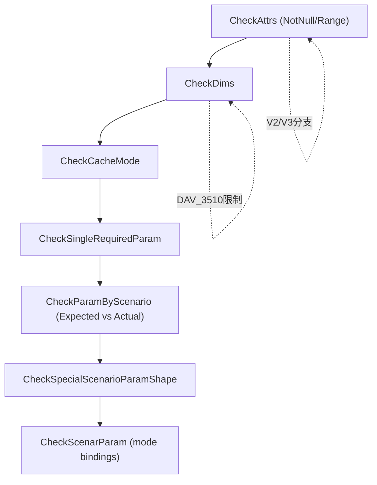

# MlaProlog Tiling Check 设计文档（含未实现 FP8/HIF8 全量化提案）

## 1. 目的与范围
本文档描述 `mla_prolog_tiling_check.cpp/.h` 的 tiling 参数校验逻辑，覆盖 V2/V3 路径、形状/格式/dtype 规则、cache mode 约束、场景化量化分支，并补充未实现的 FP8/HIF8 全量化模式的**提案式**检查规范（明确为未来支持，不代表当前实现）。

## 2. 关键结构与常量
依赖 `mla_prolog_tiling.h` 的关键常量（示例）：
- `HCQ_SIZE=1536`, `HCKV_SIZE=512`, `D_SIZE=128`, `DR_SIZE=64`
- `NKV_SIZE=1`, `MXFP8_BLOCK_SIZE=32`
- `MIN_BLOCK_SIZE=16`, `MAX_BLOCK_SIZE=1024`, `ALIGN_BLOCK_SIZE=16`

关键枚举：
- `QUANT_MODE`：`0..9`（NO_QUANT, PARTIAL/FULL, MXFP8 FULL 等）
- `WEIGHT_QUANT_MODE`：`0..3`（NO_QUANT, PARTIAL, FULL, MXFP8_FULL）
- `KV_QUANT_MODE`：`0..3`（NO_QUANT, PER_TENSOR, PER_CHANNEL, PER_TILE）
- `QUERY_QUANT_MODE`：`0/1`（NO_QUANT / PER_TOKEN_HEAD）
- `CKVKR_REPO_MODE`：`0/1`（DIVIDE / COMBINE）
- `QUANT_SCALE_REPO_MODE`：`0/1`（DIVIDE / COMBINE）

`ParamInfo` 比较规则：
- 允许 ND/NCHW 兼容（`ge::FORMAT_ND`, `ge::FORMAT_NCHW`）。
- dtype/shape/维度数不一致会报错。

`DTYPE_TO_SIZE` 用于计算 `Dtile` 字节对齐（INT8/BF16/FLOAT 等）。

## 3. 校验流程总览（Mermaid）



## 4. 属性校验（CheckAttrs）

### 4.1 CheckAttrsNotNull
V3 必需 attr（在 `opType == V3` 时必须非空）：
- `queryNormFlag`
- `weightQuantMode`, `kvQuantMode`, `queryQuantMode`
- `ckvkrRepoMode`, `quantScaleRepoMode`
- `tileSize`
- `qc_qr_scale`, `kc_scale`
- 以及通用的 `rmsNormEspilonCq`, `rmsNormEspilonCkv`, `cacheMode`

### 4.2 CheckAttrsRange
V3 当前实现允许：
- `weightQuantMode ∈ {0,1,2,3}`
- `kvQuantMode ∈ {0,1,2,3}`
- `queryQuantMode ∈ {0,1}`
- `ckvkrRepoMode ∈ {0,1}`
- `quantScaleRepoMode ∈ {0,1}`
- `tileSize = 128`

## 5. 维度校验（CheckDims）
通用约束：
- `B <= MAX_B_SIZE`
- `He ∈ {1024, 2048, 3072, 4096, 5120, 6144, 7168, 7680, 8192}`
- `Hcq == HCQ_SIZE`, `Hckv == HCKV_SIZE`
- `D == D_SIZE`, `Dr == DR_SIZE`
- `N ∈ {1,2,4,8,16,32,64,128}`
- `Nkv == NKV_SIZE`
- 非 `BSND/TND` 时 `blockSize` 必须 ∈ `[MIN, MAX]` 且 `ALIGN_BLOCK_SIZE` 对齐

Dtile 公式（仅 V3 校验）：
```
dtile = Hckv
if ckvkrRepoMode == COMBINE:
    dtile += Dr * (BF16_bytes / INT8_bytes)
if quantScaleRepoMode == COMBINE:
    dtile += Hckv / tileSize * (FLOAT_bytes / INT8_bytes)
```
若实际 `dtileSize` 不等于计算值则报错。

架构分支（`DAV_3510`）：
仅允许特定 `QUANT_MODE` 组合：
`NO_QUANT`, `PARTIAL_QUANT_KV_NO_QUANT`, `PARTIAL_QUANT_KV_QUANT_PER_CHANNEL`,
`MXFP8_FULL_QUANT_KV_NO_QUANT`, `MXFP8_FULL_QUANT_KV_QUANT_PER_TENSOR`,
`MXFP8_FULL_QUANT_KV_QUANT_PER_TILE`。

## 6. cache_mode 规则（CheckCacheMode）
V2：仅允许 `PA_BSND / PA_NZ`。
V3：允许 `{BSND, TND, PA_BSND, PA_NZ, PA_BLK_BSND, PA_BLK_NZ}`。

`CheckCacheModeParamShape`：
- `TND`：`tokenX` dim=2，`kvCache` dim=3
- `BSND`：`tokenX` dim=3，`kvCache` dim=4
- `PA_*`：`kvCache` dim=4

per-tile 限制：
当 `kvQuantMode == PER_TILE` 时，禁止 `cacheMode ∈ {PA_NZ, PA_BLK_BSND, PA_BLK_NZ}`。

## 7. 单参数校验（CheckSingleRequiredParam）
对每个参数校验 dtype / format / dim 数：
例如 `tokenX / weightDq / weightUqQr / weightDkvKr / kvCache / krCache` 等。

架构分支：
- `DAV_3510` 允许 `DT_FLOAT8_E4M3FN`（部分参数）
- 其他架构仅允许 `DT_BF16 / DT_INT8`

`cacheIndex` 特殊处理：
V3 早返回（不做单参数 dtype/shape 检查）。

## 8. 期望参数推导与场景化检查（GenExpectedParamInfo）

### 8.1 公共推导
`FillRequiredParamShapeWithDims` 依据 `batchSeqFusedFlag` 和 `cacheMode` 生成期望形状：
- fused 时 `tokenX/query/query_rope` 使用 `T` 维度
- 非 fused 时保留 `B,S1` 维度
- `KV/KR cache` 形状随 `cacheMode` 为 `TND/BSND/PA_*` 对应的 3D/4D

`FillOptionalOutputParamShapeWithDimsV3`：
- `dequantScaleQNope`：仅在 FULL_QUANT_KV_QUANT_PER_TENSOR / MXFP8_FULL_QUANT_KV_QUANT_PER_TENSOR 有效
- `queryNorm` 与 `dequantScaleQNorm`：受 `queryNormFlag` 和量化模式影响 dtype/shape

### 8.2 场景化量化分支（FillScenarioParamInfo）
`QUANT_MODE` 映射到不同的 dtype/shape 期望。
示意表（简化）：

| QUANT_MODE | tokenX/weight* dtype | kv_cache dtype | query dtype | scale 输入 |
| --- | --- | --- | --- | --- |
| NO_QUANT | BF16 | BF16 | BF16 | 无 |
| PARTIAL_QUANT_KV_NO_QUANT | tokenX BF16, weightUqQr INT8 | BF16 | BF16 | dequantScaleWUqQr, smoothScalesCq |
| FULL_QUANT_KV_QUANT_PER_TENSOR | token/weights INT8 | INT8 | INT8 | dequantScaleX/WDq/WDkvKr + quantScaleCkv |
| MXFP8_FULL_* | token/weights FP8 | FP8 | FP8 | dequantScale* (E8M0) |

### 8.3 queryNormFlag 的影响
若 `queryNormFlag=1`：
- NO_QUANT: `queryNorm` BF16, `dequantScaleQNorm` FLOAT (空)
- MXFP8_FULL: `queryNorm` FP8, `dequantScaleQNorm` FP8_E8M0
- 其他量化：`queryNorm` INT8, `dequantScaleQNorm` FLOAT

若 `queryNormFlag=0`：输出空张量，但 dtype 仍按场景配置。

## 9. 特殊场景检查
`CheckCkvkrRepoMode`：
当 `ckvkrRepoMode=COMBINE` 时，`kr_cache/kr_cache_out` 必须为空张量。

`CheckCacheIndexDim`：
`PA_BLK_*` 且 `batchSeqFusedFlag=1` 时，`cacheIndex` 必须为 1D。

`CheckScenarParam`：
- `ckvkrRepoMode` 与 `quantScaleRepoMode` 在 per-tile 与非 per-tile 情况下必须一致
- `queryQuantMode` 与 `quantMode` 绑定（full-quant per-tensor 需要 `PER_TOKEN_HEAD`）

## 10. 未实现 FP8/HIF8 full quant 模式（提案）
以下内容为“建议/未来支持”，不代表当前实现。

**核心原则**：FP8/HIF8 full quant 与 **INT8 full quant 的交叉校验完全一致**，功能也一致，**唯一差异是 tokenX 与权重张量的 dtype 由 INT8 改为 FP8/HIF8**。

### 10.1 扩展枚举（建议）
新增 `WEIGHT_QUANT_MODE::FULL_FP8_E4M3` 与 `WEIGHT_QUANT_MODE::FULL_HIF8`（假设值 4/5）。

### 10.2 交叉校验规则（与 INT8 FULL QUANT 完全一致）
以下校验逻辑全部复用 `FULL_QUANT`（INT8）路径：
- `CheckAttrsRange`：允许 `weightQuantMode ∈ {0,1,2,3,4,5}`。
- `CheckDims`：He/N/Hcq/Hckv/D/Dr/Nkv、blockSize、Dtile 公式完全一致。
- `CheckCacheMode`：per-tile 禁止 `PA_NZ/PA_BLK_BSND/PA_BLK_NZ` 组合规则完全一致。
- `CheckScenarParam`：`queryQuantMode` 绑定规则与 FULL_QUANT 完全一致。
- `CheckParamByScenario`：期望 shape/format 与 FULL_QUANT 相同。

### 10.3 dtype 差异（仅输入 tokenX 与权重）
与 INT8 FULL QUANT 相同的部分：
- `kvCache` / `kvCacheOut` dtype 仍为 `DT_INT8`。
- `query` dtype 仍为 `DT_INT8`（当 `FULL_QUANT_KV_QUANT_PER_TENSOR` 时）。
- `dequantScaleX / dequantScaleWDq / dequantScaleWDkvKr` 仍为 `DT_FLOAT`。
- `dequantScaleQNope / dequantScaleQNorm` 仍为 `DT_FLOAT`。
- `queryNorm` 仍为 `DT_INT8`（与 INT8 FULL QUANT 相同）。

**仅改变的 dtype**：
- `tokenX`：由 `DT_INT8` 改为 `DT_FLOAT8_E4M3FN` 或 `DT_HIFLOAT8`。
- `weightDq / weightUqQr / weightDkvKr`：由 `DT_INT8` 改为 `DT_FLOAT8_E4M3FN` 或 `DT_HIFLOAT8`。

### 10.4 场景化期望（建议）
在 `FillScenarioParamInfo` 中，以 `FillFullQuantParamInfo` 为基础：
- 仅替换 `tokenX/weightDq/weightUqQr/weightDkvKr` dtype 为 FP8/HIF8。
- 其余参数 dtype、shape、format 与 INT8 FULL QUANT 完全一致。

### 10.5 运行时限制（建议）
标记仅在支持 FP8/HIF8 的架构开放（与当前 float8 允许逻辑一致，优先考虑 `DAV_3510` 或后续架构）。

## 11. 错误日志与对齐建议
常见失败源：
- `CheckAttrsRange`：量化/模式取值非法
- `CheckDims`：He/N/Hcq/Hckv/D/Dr/Nkv 或 blockSize 不合法
- `CheckCacheMode`：cacheMode 不支持或形状维数不匹配
- `CheckParamByScenario`：dtype/shape/format 与期望不一致
- `CheckScenarParam`：repo 模式或 queryQuantMode 与 quantMode 绑定不一致

定位建议：按流程依次排查 `CheckAttrs → CheckDims → CheckCacheMode → CheckParamByScenario`，最后检查特殊场景逻辑。
