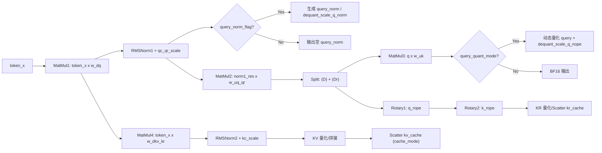

# MlaPrologV3 CPU 参考实现设计文档（详细版）

## 1. 目的与范围
本文档系统化描述 `prologv3_generalized.py` 中 CPU 参考实现的行为与边界，目标是与 `torch_npu.npu_mla_prolog_v3` 的功能与输出对齐，用于 pytest 功能验证与维护。覆盖范围以当前 pytest 允许的参数组合与运行时限制为准，包含 mxfp8/FP8/HIF8 条件跳过逻辑。

## 2. 入口与核心类
入口函数为 `test_prologv3_generalized(params)`，负责构造输入、调用 CPU 参考并对齐 NPU 输出。

CPU 参考实现入口为 `GeneralizedPrologV3.forward(inputs)`，其内部完成完整的数据流、量化/反量化、旋转位置编码、kv/kr cache 写回等逻辑。

关键控制参数说明：
- `query_norm_flag`：是否输出 `query_norm` 及其 `dequant_scale_q_norm`。
- `smooth_scales_cq_flag`：是否向动态量化提供 `smooth_scale_cq`，仅在量化场景下生效。
- `qc_qr_scale`：作用于 RMSNorm1 之后的缩放（Query 侧）。
- `kc_scale`：作用于 RMSNorm2 之后的缩放（Key/CKV 侧）。

## 3. 输入/输出定义（含形状与 dtype）

### 3.1 维度符号
- `B`: batch_size
- `S1`: q_seq
- `S2`: kv_seq，当前实现中 `S2 = S1`
- `N1`: q_head_num
- `N2`: kv_head_num（固定为 1）
- `D`: head_dim（=128）
- `Dr`: rope_head_dim（=64）
- `He`: hidden size
- `Hcq`: q 低秩维度（=1536）
- `Hckv`: kv 低秩维度（=512）
- `T`: `B * S1`
- `BlockSize`: block_size（=16 或 128）
- `Dtile`: kv cache 最后一维，随量化模式变化
- `t_flag`: `bs_fused_flag` 为真或 `cache_mode == "TND"` 时为真，输入按 `(T, *)` 处理

### 3.2 输入张量（`inputs`）
必需输入：
- `token_x`: `(T, He)` 或 `(B, S1, He)`，dtype 随量化模式变化
- `w_dq`: `(He, Hcq)`
- `w_uq_qr`: `(Hcq, N1*(D+Dr))`
- `w_uk`: `(N1, D, Hckv)`
- `w_dkv_kr`: `(He, Hckv+Dr)`
- `gamma_cq`: `(Hcq,)`
- `gamma_ckv`: `(Hckv,)`
- `sin`: `(T, Dr)` 或 `(B, S1, Dr)`
- `cos`: `(T, Dr)` 或 `(B, S1, Dr)`
- `index_table`: PA 模式下的索引表
- `kv_cache`: cache 张量，形状由 `cache_mode` 决定
- `kr_cache`: cache 张量，形状由 `cache_mode` 决定或为空

可选量化/scale 输入：
- `deq_scale_x`: `(T, 1)` 或 `(T, He//32)`（mxfp8）
- `deq_scale_w_dq`: `(1, Hcq)` 或 `(Hcq, He//32)`（mxfp8）
- `deq_scale_w_uqqr`: `(1, N1*(D+Dr))` 或 `(N1*(D+Dr), Hcq//32)`（mxfp8）
- `deq_scale_w_dkvkr`: `(1, Hckv+Dr)` 或 `(Hckv+Dr, He//32)`（mxfp8）
- `quant_scale_ckv`: `(1,)` 或 `(1, Hckv)`
- `quant_scale_ckr`: `(1, Dr)`
- `smooth_scale_cq`: `(1, Hcq)`（仅当 `smooth_scales_cq_flag=1` 时使用）
- `actual_seq_len`: `TND` 或部分 `PA_BLK` 场景下提供
- `k_nope_clip_alpha`: per-tile kv quant 的 clip 参数

### 3.3 输出
CPU 参考返回：
- `query`: `(T, N1, Hckv)` 或 `(B, S1, N1, Hckv)`
- `query_rope`: `(T, N1, Dr)` 或 `(B, S1, N1, Dr)`
- `dequant_scale_q_nope`: `(T, N1, 1)` 的 scale（若量化输出）
- `query_norm`: `(T, Hcq)` 或 `(B, S1, Hcq)`，由 `query_norm_flag` 控制
- `dequant_scale_q_norm`: `(T, 1)` 或 `(T, Hcq//32)`（mxfp8）或空张量
- `kv_cache`、`kr_cache` 原地更新结果

## 4. 全量流程图（Mermaid）

## 5. 关键计算阶段

### 5.1 MatMul1 + Dequant
`token_x @ w_dq -> matmul1_res`。根据 `weight_quant_mode` 决定输入 dtype 与反量化策略：
- full/int8 或 fp8/hif8 模式会先进行反量化。
- mxfp8 模式使用 blockwise 反量化（block size=32）。

### 5.2 RMSNorm1
对 `matmul1_res` 执行 RMSNorm，并乘以 `gamma_cq` 与 `qc_qr_scale`。

### 5.3 MatMul2 + 动态量化
`norm1_res @ w_uq_qr -> matmul2_res`。
- 当 `weight_quant_mode` 需要动态量化时调用 `dynamic_quant`。
- `smooth_scales_cq_flag=1` 时使用 `smooth_scale_cq`，否则走无 smooth 的动态量化。

### 5.4 Query Norm 输出
当 `query_norm_flag=1` 时输出 `query_norm`：
- 非量化：BF16。
- int8：per-token 动态量化并输出 scale。
- mxfp8：输出 FP8 + per-block scale。

### 5.5 MatMul3 + Query 输出量化
`splitd1_res1 @ w_uk -> out1`。
当 `query_quant_mode=1` 时，对 `out1` 进行 per-token-head 量化并生成 `dequant_scale_q_nope`。

### 5.6 Rotary1 / Rotary2
`splitd1_res2` 执行旋转位置编码得到 `query_rope`。  
`k` 执行旋转位置编码得到 `rotary2_res`，根据 kv 量化模式可能进一步量化。

### 5.7 RMSNorm2 + kc_scale
`matmul4_res` 经 RMSNorm2，乘以 `gamma_ckv` 与 `kc_scale`，得到 `norm2_res`。

### 5.8 KV/KR Scatter
根据 `cache_mode` 写回 `kv_cache` / `kr_cache`：
- `PA_NZ`、`PA_BSND`、`PA_BLK_BSND`、`PA_BLK_NZ` 使用 index_table 进行块级散射。
- `BSND` 与 `TND` 走标准 reshape + 直写。

## 6. 量化与反量化细节

### 6.1 weight_quant_mode
- `0`: 无量化，BF16。
- `1`: `w_uq_qr` int8 动态量化，其他 BF16。
- `2`: full int8，`token_x/w_dq/w_uq_qr/w_dkv_kr` 量化并配合 deq scale。
- `3`: mxfp8，FP8 blockwise 量化，block size=32，`dtype_max=448`。
- `4`: full fp8 e4m3。
- `5`: full hif8。

### 6.2 kv_quant_mode
- `0`: 无量化，kv_cache BF16。
- `1`: per-tensor 量化（int8 或 fp8，取决于 weight_quant_mode）。
- `2`: per-channel 量化（ckv/ckr 有独立 scale）。
- `3`: per-tile 量化，要求 `ckvkr_repo_mode=1` 且 `quant_scale_repo_mode=1`。

### 6.3 query_quant_mode
仅当 `weight_quant_mode in {2,3,4,5} 且 kv_quant_mode==1` 时为 1。

### 6.4 mxfp8
CPU 参考实现采用 blockwise quant/dequant：
- block size = 32
- `dtype_max = 448`
- scale 维度为 `(T, H//32)` 或 `(K, H//32)`

### 6.5 smooth_scales_cq_flag
- 当 `smooth_scales_cq_flag=1` 时，`dynamic_quant` 使用 `smooth_scale_cq`。
- 否则视为无 smooth 的动态量化。

## 7. Cache 模式与 Index 语义

支持 `cache_mode`：
- `PA_BSND / PA_NZ / PA_BLK_BSND / PA_BLK_NZ / BSND / TND`

`index_table` 行为：
- `PA_BSND / PA_NZ`：`index_table` reshape 为 `(T,)`。
- `PA_BLK_*`：保持块级 `(B, pages_per_b)` 结构。
- `BSND / TND`：不使用 `index_table`。

`actual_seq_len`：
- 在 `t_flag` 为真时生成，用于 TND 或部分 PA_BLK fused 场景。

## 8. 约束、跳过逻辑与校验

组合限制（`validate_quant_cache_combo`）：
- `weight_quant_mode` 与 `kv_quant_mode` 必须匹配既定组合。
- `kv_quant_mode=3` 仅允许 `cache_mode` 为 `PA_BSND / BSND / TND`。
- `kv_quant_mode=3` 要求 `ckvkr_repo_mode=1` 且 `quant_scale_repo_mode=1`。
- `query_quant_mode` 必须与量化组合一致。

运行时跳过：
- mxfp8 需要 `float8_e4m3fn + float8_e8m0` 支持且运行设备为 Ascend 950。
- full fp8 需要 `torch.float8_e4m3fn`。
- hif8 需要 `torch_npu.hifloat8`。

输入校验（`check_valid_param.validate_config`）：
- `B` 范围 1..65536
- `S1` 范围 1..16
- `He` 属于支持集合
- `Hcq=1536`, `Hckv=512`, `D=128`, `Dr=64`
- `kv_head_num=1`
- `block_size` 为 16 或 128
- `input_layout` 为 `BSH / BSND / BNSD`
- `cache_mode` 与 `bs_fused_flag` 约束匹配
- `query_norm_flag`、`smooth_scales_cq_flag` 为 0/1

## 9. 环境变量
- `MLA_PROLOG_V3_CPU_INFO_LOG`：CPU 参考实现 INFO 日志开关。
- `MLA_PROLOG_V3_ENABLE_DISCONTINUOUS_ERROR`：允许离散误差点模式。
- `MLA_PROLOG_V3_DISCONTINUOUS_ERROR_MAX_RATIO`：误差点比例阈值。
- `MLA_PROLOG_V3_DISCONTINUOUS_ERROR_MAX_COUNT`：误差点数量阈值。

## 10. 与 Kernel 对齐的关键假设
- `query_norm_flag` 控制 `query_norm` 与 `dequant_scale_q_norm` 的输出形态与 dtype。
- `qc_qr_scale` 在 RMSNorm1 后作用，`kc_scale` 在 RMSNorm2 后作用。
- mxfp8 使用 blockwise 量化（block=32）并以 `dtype_max=448` 进行缩放。
- int8 动态量化为 per-token 方案，`smooth_scales_cq_flag` 决定是否使用 smooth scale。
- cache 写回路径严格遵循 `cache_mode` 与 `index_table` 的语义。

