# FlashAttentionGrad确定性性能优化案例

# 1 前言

在深度学习领域，注意力机制已成为Transformer架构的核心组件，而FlashAttention的提出则在大规模模型训练中实现了突破性的计算加速。然而，在实际生产环境中，我们面临着一个长期被忽视却至关重要的挑战——FlashAttentionGrad（FAG）的确定性问题。

FlashAttention虽然在前向计算中大幅提升了效率，但其反向梯度计算由于采用了非确定性原子操作（atomic operations）策略，导致多次运行之间即便输入完全相同，梯度结果也可能存在微小差异。一方面，这种非确定性行为在模型训练、调试以及验证场景中带来了严重困扰：研究人员难以复现实验结果，模型收敛行为变得不可预测等。另一方面，确定性往往以牺牲性能为代价。简单的确定性实现可能导致显存占用增加、计算效率显著下降，使得原本FlashAttention带来的性能红利在反向传播中大打折扣。

本案例围绕FlashAttentionGrad的确定性性能优化展开，从非确定性产生的根源出发，系统性地分析原子操作竞争、并行归约顺序、浮点运算结合律等关键因素，并提出了一套兼顾确定性与高性能的优化方案。我们通过算子融合、内存布局重排、确定性归约算法等手段，实现反向梯度计算在主流硬件平台上的高效执行。

## 1.1 FlashAttention计算公式

为了更好的理解优化原理，我们先介绍下FlashAttention算子的计算公式。

考虑标准的多头注意力（Multi-Head Attention）模块，对于单个头，输入为查询矩阵 $Q \in \mathbb{R}^{N \times d}$、键矩阵 $K \in \mathbb{R}^{M \times d}$、值矩阵 $V \in \mathbb{R}^{M \times d_v}$，输出为 $O \in \mathbb{R}^{N \times d_v}$。为简化符号，我们假设 $d = d_v$，且 $N = M$（自注意力情形），但公式可推广至一般情况。

**前向传播的核心计算：**
$$
S = Q K^\top \in \mathbb{R}^{N \times N},\quad P = \text{softmax}\left( \frac{S}{\sqrt{d}} \right),\quad O = P V
$$

**反向传播的核心计算：**

**反向传播**需要计算损失 $L$ 对 $Q, K, V$ 的梯度。已知输出梯度 $dO = \frac{\partial L}{\partial O} \in \mathbb{R}^{N \times d}$，反向传播的数学表达式为：
$$
\begin{aligned}
dV &= P^\top dO, \qquad dQ = dS \, K,\qquad dK = dS^\top Q
\end{aligned}
$$

$$
dP = dO \, V^\top
$$
$$
dS = dP \odot \frac{\partial \text{softmax}}{\partial S} = dP \odot \left( P \odot (\mathbf{1}_{N \times N} - \text{rowsum}(P) \odot \mathbf{1}_{1 \times N}) \right) / \sqrt{d},
$$
其中 $\text{rowsum}(P)$ 表示对 $P$ 的行求和（向量），$\mathbf{1}$ 为全1矩阵。


在实际实现中，为了避免显式存储 $S$ 和 $P$，FlashAttention 的反向传播会利用前向计算时保存的统计量（每行的最大值 $m$ 以及指数和 $l$）重新计算 $P$，从而在反向中再次分块计算。

## 1.2 FAG非确定性来源

在这一节，我们主要介绍下为什么FAG会引入非确定性因素。

目前FA算子一般有[batch_num, seqlen, head_num, head_dim]这些维度，主流模型中seqlen一般都比较长（大于32K），那么在计算中间结果的P矩阵或S矩阵的时候，就会出现shape为（seqlen, seqlen）的矩阵，将近存在1G的元素个数。**因此，针对这种长序列的场景，FAG会基于seqlen将数据分成粒度更小的分块，并将这些分块分发到不同的Cube核上计算，最后再将这些分块的计算结果通过AtmoicAdd指令在GlobalMemery上累加，从而得到最终的计算结果。**

然而，由于seqlen切块是均匀分到不同的Cube核上进行计算的，而每个Cube核计算的速度是随机的，因此导致最后的累加顺序是不固定的。如下图所示：

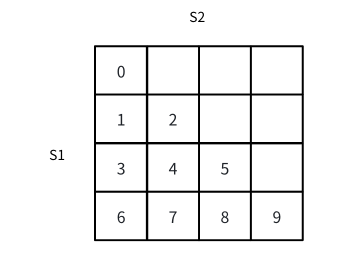

以dq（shape = [seqlen, head_dim]）举例, 其需要根据 S2轴进行reduce。由于block3、block4、block5分别在不同的核上，因此其累加顺序是不确定的，可能的累加顺序情况如下：
1. out = (block_3 + block_4) + block_5
2. out = (block_3 + block_5) + block_4

由于，浮点数的累加不满足加法结合律，不同累加顺序可能会导致最终结果的不一致。因此，为了保证在相同输入的情况下，得到相同的输出，我们需要控制累加顺序严格一致。
```
注：加法结合律是指三个数相加，先把前两个数相加，或者先把后两个数相加，和不变。
```

## 1.3 确定性方案

基于上一节的内容，我们已经知道了FAG产生非确定性的根因，也就是在最后进行规约（Reduce）计算时，采用的AtmoicAdd导致的，那么我们为了实现确定性功能，我们必须放弃通过AtmoicAdd形式的计算，转而通过Vector核将数据按序累加。然而，由于在A2/A3的硬件上Cube核和Vector核之间不存在数据通路，因此需要额外开辟一块Workspace用于临时存放Cube的计算结果，并用Vector核进行累加。

1、首先，对于每个cube核的计算结果，我们需要额外去开辟一块workspace空间用于存放中间结果（非确定性的计算结果可以直接通过atmoicAdd指令，直接输出到GM上）。
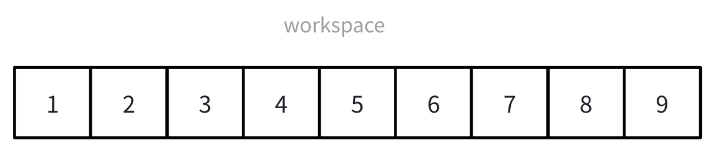

2、当所有cube核计算完后( SyncAll( ) 控制 )，我们需要在vector核上进行依次累加。

3、接着，在vector核上依次从不同的workspace上搬运数据，并将最终结果输出至GM上。
```
tmp_result = 0;            //用于存放中间临时结果
core_idx = GetBlockIdx(); //获取当前核的index

for add_block_index in total_add_num:
    mm_result = DataCopyIn(core_idx，add_block_index)
    tmp_result += mm_result
out = DataCopyOut(block_idx, tmp_result)
```

# 2 流水排布
对于CV类算子来说，为了能够充分做到Cube核和Vector核的并行，一般会用到双发。何为双发？例如，若不考虑CV并行，FAG的计算流应该如下：

可以看到，这种情况下，由于Cube和Vector核之间有强数据依赖关系，因此其是串形执行的。而双发就是为了解决这种问题。我们预先发射两次Matmul计算，并在第二次matmul计算的同时计算第一次Vector的计算结果，从而达到了CV之间的并行。

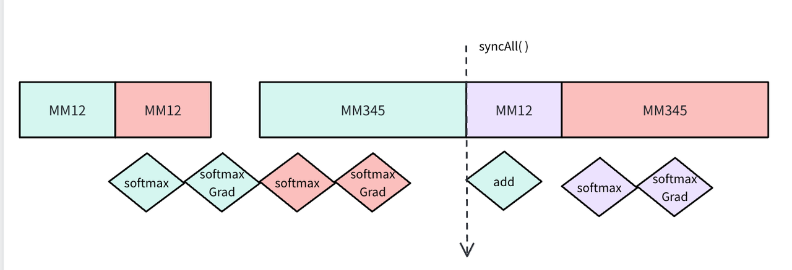

# 3 分核策略

对于FAG的分核策略，我们仍然采用[512,512]的分核策略（这是一个久经考验的经验值），并以Cube核的视角进行分配。

我们知道一个Cube核有两个从属的Vector核，因此，基于负载均衡的考虑，我们会将一个Cube核计算的结果，均匀划分到两个Vector核上计算。

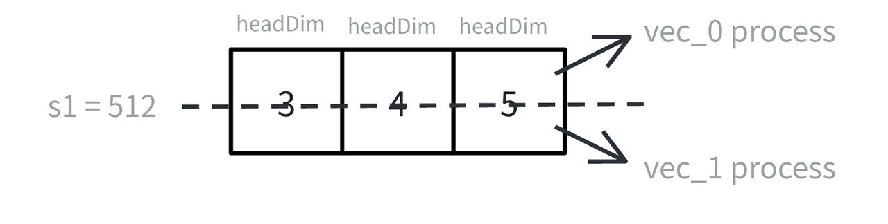

# GEMM优化

从FAG的计算公式中，我们可以看到FAG中存在5个Matmul的计算和2个Vector计算，那么显而易见的，FAG的性能瓶颈在于Cube核的计算速度。这一节，我们主要介绍下在A2/A3的硬件架构下，通用矩阵乘的优化思路：

对于一次常规的Cube计算，我们一般会开启DoubleBuffer，将流水之间的耗时相互掩盖，如下图所示：

可以看到上述的计算方式效率很差，因为其流水都是串行进行的，为了更好优化性能，我们一般会开启DoubleBuffer，将流水之间进行相互掩盖，如下图所示：
<div align="center">
  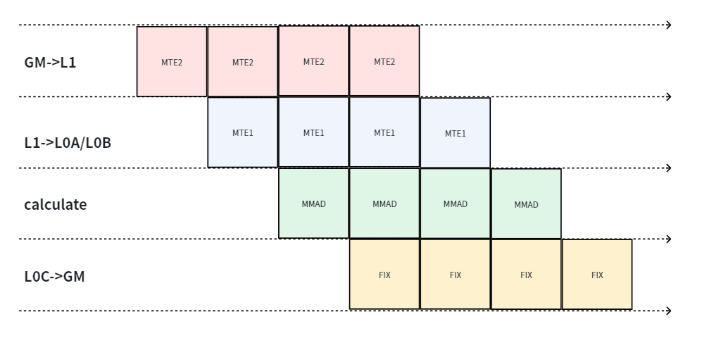
</div>

然而，在实际开发中，我们的流水排布还受限于L1/L0的空间大小，对于不同的Tiling和分块方案，相应的流水排布都需要对应调整。在本次FAG的优化中，我们选取的base块大小为[128, 128]，对于半精度数据类型，其正好占用32k的L0A/L0B。而A2/A3的L0A/L0B的大小为64K，正好开启DoubleBuffer。

## 搬运优化

在FAG中，我们按Cube核分块的粒度为[512, 512]。那么，以[128, 128]的base块粒度进行计算，我们总共需要计算16次。
<div align="center">
  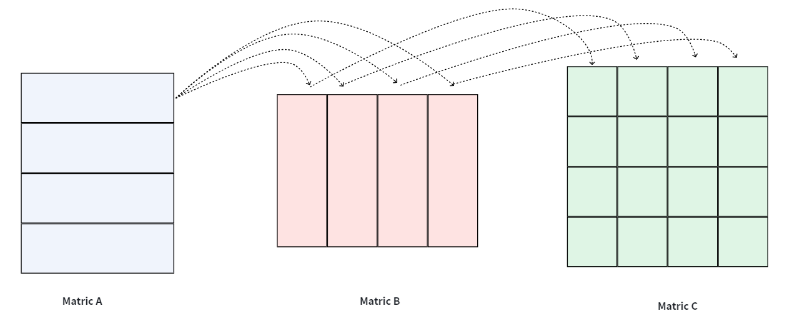
</div>
可以发现，假设我们以MatrixA为外循环，MatrixB为内循环，MatrixB的数据是可以复用的。基于这个思路，我们在L1上开辟一块临时的空间，当第一次搬运时将MatrixB的数据存放在这块。那么，再之后对于B矩阵的搬运，我们都可以省去重复搬运。

另一方面，回看FAG的计算公式，由于FAG需要重计算，因此存在P=QK和dk=dsQ的步骤，其两个公式都用到了Query，那么我们是否可以再计算P时，将Query常驻再L1上，留到dK的时候再使用呢？答案是可以的。但由于我们之前实现了双发，导致会存在两份Query数据，因此我们需要保留两份L1空间，用于Dk计算时候复用。同理，对于dy和key的复用，也是可以的，但是由于L1空间和分核策略的限制，本方案仅采用了Query复用方案。

## FIX_PIPE优化

从之前章节中，我们知道，在计算dq、dk和dv的时候，是需要将结果进行Reduce计算的，一种方案是通过FIX_PIPE搬出L0C并通过AtmoicAdd直接累加到GM上，如下图所示：
<div align="center">
  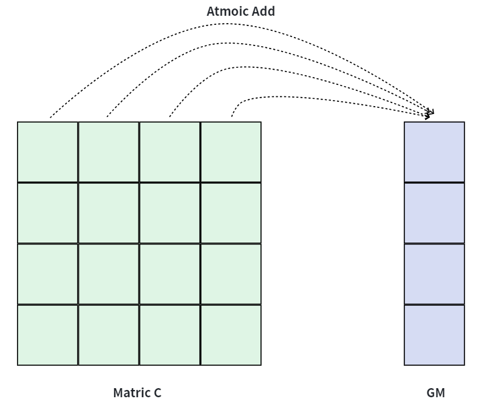
</div>

上述的方案不仅占用了额外的带宽，而且由于采用了AtmoicAdd，带宽利用率也有相对更低。我们针对这部分的Reduce，采用L0C累加，当所有累加结果结束以后，最后再通过FIX_PIPE搬运至GM上。

<div align="center">
  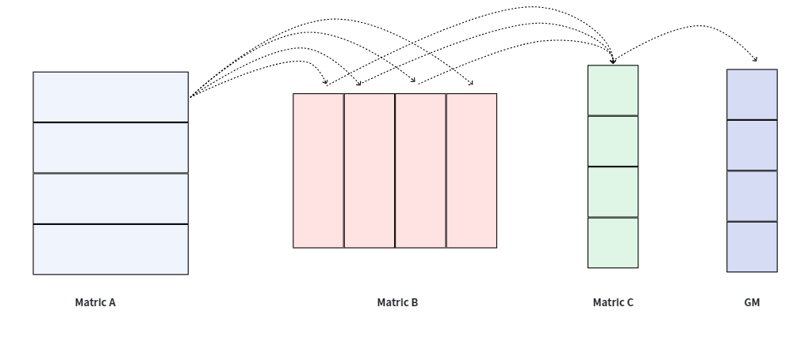
</div>


## AttenMask优化

**AttenMask**（注意力掩码）是在注意力机制中用于控制 token 之间交互范围的矩阵。它通常与注意力分数矩阵 $S = QK^\top$ 形状相同，元素取值为 $0$（允许注意）或 $-\infty$（屏蔽），在 softmax 前与 $S$ 相加：

$$
P = \text{softmax}\left( \frac{S + M}{\sqrt{d}} \right)
$$

其中 $M$ 即为 AttenMask。通过这种方式，被屏蔽的位置在 softmax 后权重为 $0$，不参与输出计算。


**CausalMask**（因果掩码）是 AttenMask 的一种特殊形式，主要用于自回归模型（如 GPT、LLaMA）。其结构为下三角矩阵：

$$
M_{ij} = \begin{cases}
0, & i \ge j \\
-\infty, & i < j
\end{cases}
$$

保证当前位置 $i$ 只能看到自身及之前的 token（$j \le i$），无法窥视未来信息。

## 省略无效计算

由于AttenMask的存在，因此，我们在实际计算的时候，很多块会出现为无效块的情况，针对这种情况，我们可以跳过这些计算，从而来达到更好的性能。这些稀疏块根据不同的角度存在不同的粒度：

### 分核角度
从分核的角度来看，这些蓝色块我们都可以跳过计算，如下图所示：

<div align="center">
  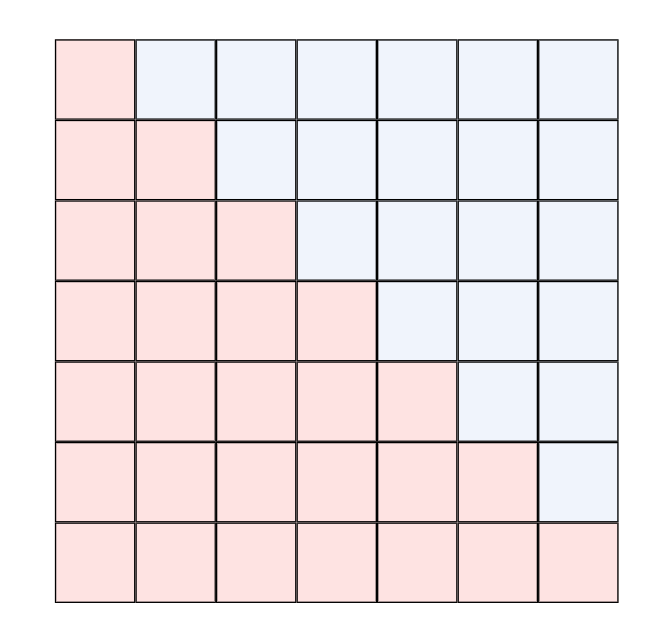
</div>

### 单核角度
从单核计算的角度来看，我们会出现3种计算情况：

第一种，计算下三角的时候，这时候，需要用到AttenMask
<div align="center">
  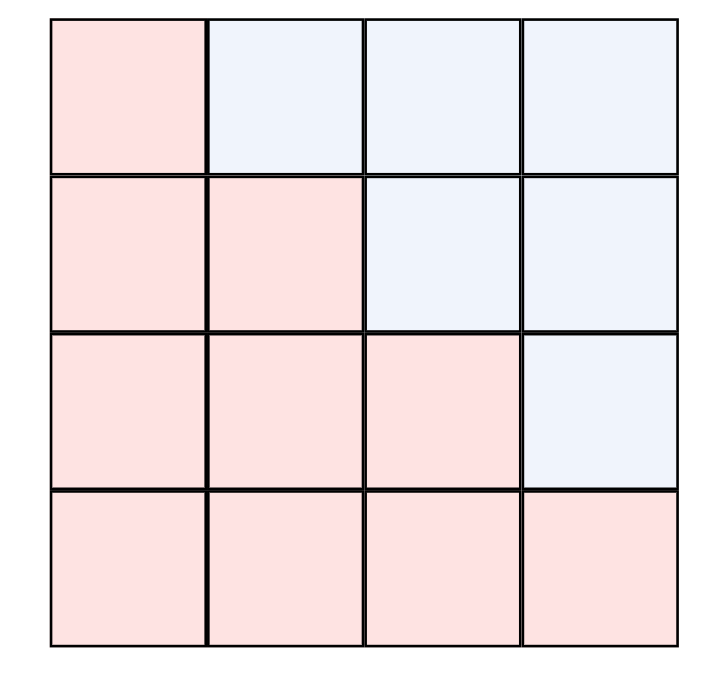
</div>

第二种，对于全部为蓝色的块，这时候，可以直接跳过计算：
<div align="center">
  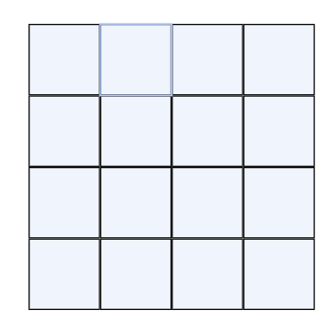
</div>


第三种，全部为红色的块，这时候，需要计算，但不需要AttenMask
<div align="center">
  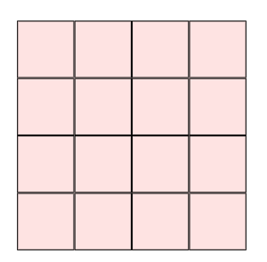
</div>


## AttenMask常驻

对于AttenMask的计算，一般如下伪代码所示：
```
CopyIn(AttenMaskLocalTensor, AttenMaskGmTensor);
Compute(softmaxLocalTensor, AttenMaskLocalTensor);
```

可以看到，上述的场景，我们需要搬运并计算S * S大小的Mask。在这一步，我们可以进行优化，由于我们的分块大小为【128，128】,可以看到，当qk等长情况下，我们需要计算AttenMask的分块都是规整的，因此，我们每次的Mask形状都是一致的，这种情况，我们利用了用空间换时间的思想，可以将AttenMask搬入以后常驻，来避免重复的搬运开销，如下面的伪代码所示。
```
if first:
  CopyIn(AttenMaskLocalTensor, AttenMaskGmTensor);
Compute(softmaxLocalTensor, AttenMaskLocalTensor);
```

# 确定性累加优化
从之前的章节可知，我们会将输入以【512，512】的粒度，分到不同的核上。在CauaslMask的情况下，我们的确定性分核，如下图所示：
<div align="center">
  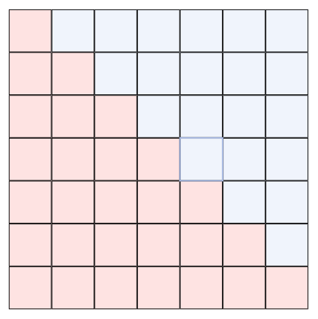
</div>
由于在A2/A3上我们的核数有24个Cube核，那么当seq_len较大的时候，我们没办法一次性计算完所有数据，就会出现多轮循环依次迭代计算。因此，会出现以下的情况，

当seq_len较大的时候，会出现不同的分核情况：

第一种情况，所有行和列都需要累加，如下图所示：
<div align="center">
  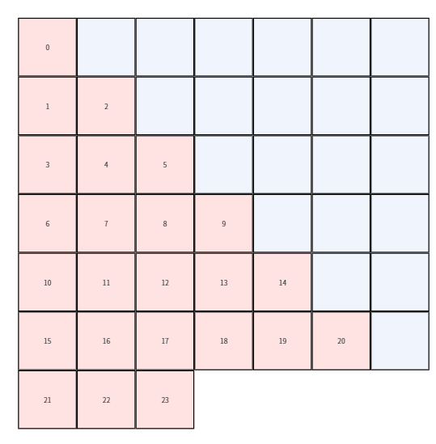
</div>

第二种情况，部分分块所在行和列仅有一块不需要累加，如下图所示：
<div align="center">
  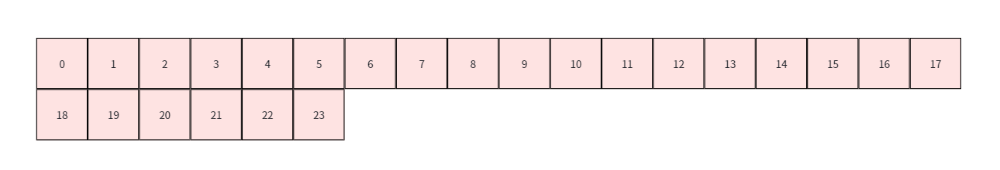
</div>
第三种情况，所有分块都在同一行，在列方向上不需要累加，如下图所示
<div align="center">
  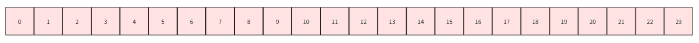
</div>


我们确定性的目的就是为了保证顺序累加，上述所说的2、3两种情况，我们对这些块甚至不需要在列方向上累加了，那么能否有办法直接将结果通过atmoic_add输出到GM上？要知道我们的A2/A3芯片没有Cube核和Vector核之间的通路，如果再将这些块搬到Vector核上再搬出到GM上，这部分会损失很多的带宽。

因此，基于这个思路，我们维护了一个atomic_add的变量，并记录所有核分到的分块最终需要输出的GM地址，如果在这一轮，需要输出到GM地址上的分块存在两个及以上，我们采用Vector核进行顺序累加并输出；若在这一轮，需要输出到GM地址上的分块仅有一个，我们便通过atmoic_Add直接输出。
<div align="center">
  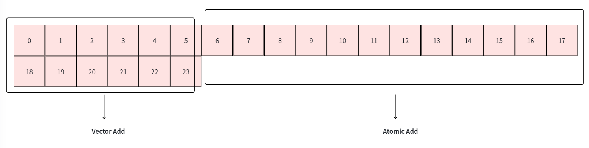
</div>

# Post优化
熟悉FAG代码的，应该都知道我们需要对dq和dk做一个乘softmax_scale的操作，而这个操作为了保证数值的稳定性是放在post阶段进行的，也就是所有计算完以后，再对其乘一个softmax_scale，并输出到最终的输出GM上。然而，为了实现这个乘法操作，我们之前所有的计算结果，都得暂存在一块随着seq_len变大的float类型的workspace上。

一方面，这块workspace会占用大量的现存。另一方面，最后的post操作需要占用额外的时延，且无法被Cube计算掩盖。由于现在最终的累加阶段被放到了Vector核上，因此，我们可以记录，什么时候行方向上的累加已经结束。如果行方向的累加已经结束，我们可以再其输出前，对其乘一个scale，最终输出到GM上，而节省post操作的耗时。

如下图所示，红框内的块都已经计算完行方向上所有的数据，此时可以直接乘一个scale并输出到输出GM上。

<div align="center">
  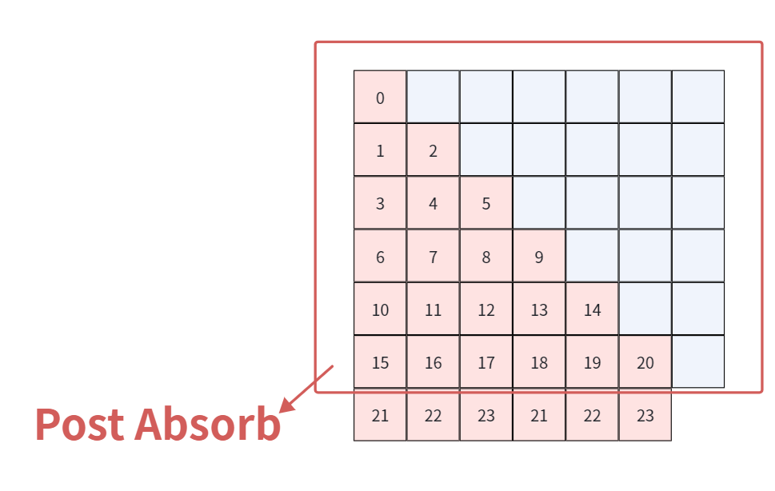
</div>

# 总结

经过上述的优化，最终我们的FAG算子的确定性性能相比前代实现在cauaslMask的情况下，性能几乎翻倍。达成了非确定性的0.95X。