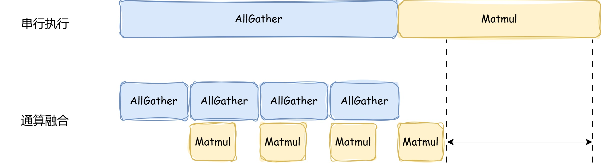
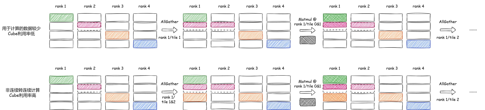

# 基于CCU通信的AllGatherMatmul算子样例
本篇文档提供如何跑通基于CCU通信方式的AllGatherMatmul通信算子用例
## 🚀 快速开始

### 步骤1：环境检查
```bash
# 检查Ascend环境
echo $ASCEND_HOME_PATH
# 预期有路径输出

# 检查CMake版本
cmake --version | head -1
# CMake版本 >= 3.16

# 检查编译器
which bisheng
# 预期返回bisheng的绝对路径
```
### 步骤2：编译运行示例

#### 2.1 添加环境变量
```bash
# 配置CANN包环境变量，此为默认路径安装，以root用户为例（非root用户，将/usr/local替换为${ASCEND_HOME_PATH}）
source /usr/local/Ascend/cann/set_env.sh
```
#### 2.2 编译自定义算子
在ops-transformer目录下，执行以下自定义算子编译命令。
```
bash build.sh --pkg --soc=ascend950 --ops="allgathermatmul" --experimental
```

#### 2.3 执行装包命令
```
cd build_out
chmod +x *.run
./*.run --install-path=/usr/local/Ascend/cann
```

#### 2.4 执行测试脚本


> 💡 **提示**：如果遇到环境配置问题，请确保：
> 1. `ASCEND_HOME_PATH`环境变量已正确设置
> 2. Bisheng编译器已安装并可用
> 3. CMake版本为3.16或更高

## 💻 实战示例：AllGatherMatmul优化

### AllGatherMatmul计算流程
AllGatherMatmul算子实现了AllGather通信和Matmul矩阵乘法的融合。算子逻辑为：对输入的通信矩阵a做AllGather通信得到Matmul计算的左矩阵，即通信结果gather_out，将gather_out和右矩阵b做Matmul运算得到输出c。对应的数学表达式为：

```
gather_out = AllGather(a)
c = gather_out ∗ b
```
MC<sup>2</sup>通算融合算子的性能收益主要来自于通信、计算的并行执行，即将输入数据切分为多个子块，子块的计算和通信任务形成两条流水线，通过两条流水线上任务的并行执行，实现流水掩盖，从而提升算子性能。如下图所示，相比于先做AllGather通信、后Matmul计算的场景，AllGatherMatmul算子通过将通信输入的矩阵切分为多块，前一块数据的Matmul计算和后一块数据的通信可以并行执行，从而达到计算和通信时间相互掩盖的目的。



### 传统实现分析
```cpp
// all_gather_matmul_fp16_bf16.h 关键代码
__aicore__ inline void AllGatherMatmulFP16BF16<AType, BType, BiasType, CType>::Process()
{
    if ASCEND_IS_AIC {
        // 先发出通信
        StartNotify();

        // 计算本卡、远端数据
        InnerProcess();

        // 结束通信
        EndNotify();
    }
}
```
**问题诊断**：
- AllGather通信启动前，本卡数据已准备好计算，此时计算单元闲置
- Matmul计算远端数据时，如果单次通信数据量较少则Cube核未完全利用

### 优化实现1-local块提前启动
AllGather通信会将其他卡数据全部收取到本卡上，然后启动计算。在通信启动前，可以先将本卡数据提前加载并启动计算，从而掩盖通信任务下发带来的额外开销，进一步释放性能。


### 优化实现2-非连续转连续

当算子进行多轮通算融合，从其他卡收取需要进行Matmul计算的数据时，如果单次AllGather通信收取的数据所需处理核数少于Cube核总数，会导致Cube核未跑满、利用率低。通过非连续转连续优化，将单次AllGather通信收取数据后Unified Buffer中剩余存储空间继续加载其他卡GatherOut数据，再启动Matmul，从而使Cube核全载处理。优化后的通信及计算流程如下图所示：



**优化亮点**：
1. 针对单次数据量不足导致CUBE核未跑满的问题，通过优化数据调度策略，实现CUBE高效利用。
2. 将分散、非连续的数据块融合为连续数据流，最大化利用Unified Buffer剩余空间。

## 支持架构
NPU ARCH 3510