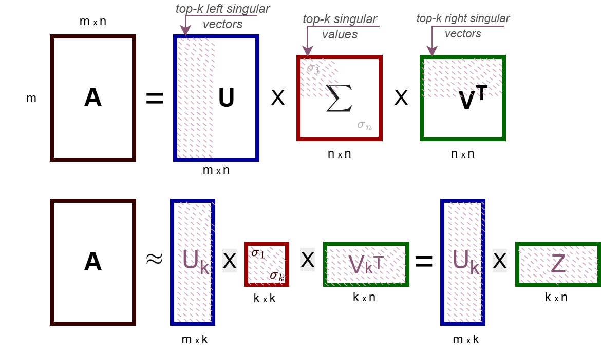
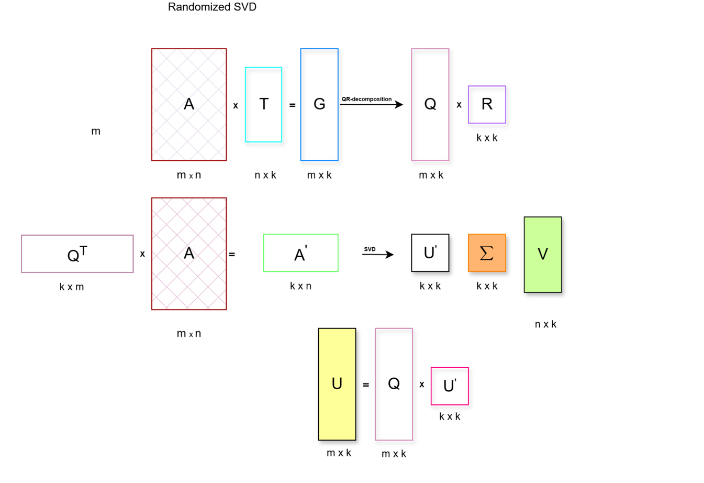
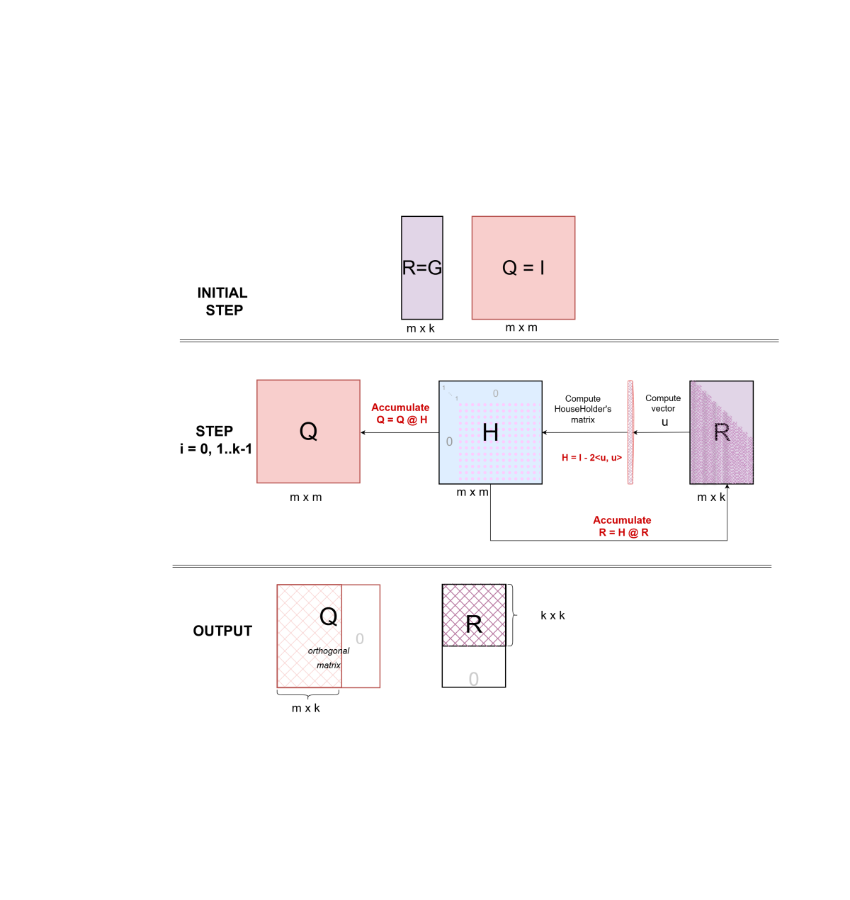

<div align="center">
<h1> Singular Value Decomposition for low-rank approximation</h1>

</div>

This directory contains reference python implementation of randomized Singular Value Decomposition(rSVD) and accuracy tests for `torch.svd`, `torch.svd_lowrank`, `torch.qr` methods.
It is proposed to use rSVD for low-rank approximation of matrix on Ascend(instead of truncated SVD) in such methods as ShadowKV and other methods pursuing a similar idea of approximation.

#### How to run accuracy tests

**<span style="color:red">Please Pay Attention the code was tested on RTX3090 only.</span>**

```bash
pytest test_svd.py
```

# Algorithms description
## Randomized SVD
   >  The implementation is based on the Algorithm 5.1 from Halko et al., 2009.
   1. Generate Gaussian matrix T.
   2. Form matrix G=A@T
   2. Compute QR factorization G = Q@R
   3. Form matrix B=Q.T@A
   4. Compute SVD of the small matrix B = U`SV*
   5. Form the orthonormal matrix U=Q@U`



## QR factorization via Householder transformation


Describe i-th step:

$G$ - target matrix, Lets $R=G$, $Q = I$

1. Compute reflection vector

    $\mathbf{x} = R[i:m, i] \in \mathbb{R}^{m-i+1}$
    $\sigma_i = -\operatorname{sign}(a_{ii}) \|\mathbf{x}\|_2$
    $\mathbf{u}_i = \mathbf{x} - \sigma_i \mathbf{e}_1^{(m-i+1)}$
    $\beta_i = \frac{2}{\|\mathbf{u}_i\|_2^2} = \frac{2}{\mathbf{u}_i^T \mathbf{u}_i}$

2. Compute Householder matrix

    $P_i = I_{m-i+1} - \beta_i \mathbf{v}_i \mathbf{v}_i^T$
    $H_i = \begin{pmatrix} I_{i-1} & 0 \\ 0 & P_i \end{pmatrix} \in \mathbb{R}^{m \times m}$

3. Update matrix $R$ and $Q$

    $R^{(i)} = H_i R^{(i-1)}$
    $Q^{(i)} = Q^{(i-1)} H_i$

## Singular Value Decomposition (One-Side Jacobi rotation approach)

Initialization

$A \in \mathbb{R}^{m \times n}, \quad V = I_n$

At each iteration of the algorithm, all pairs of indices will be considered.
For each pair of indexes $(p, q)$
1. Compute scalar the following products

$\mathbf{a}_i = A[:, p], \quad \mathbf{a}_j = A[:, q]$

$g_{ii} = \mathbf{a}_i^T \mathbf{a}_i, \quad g_{jj} = \mathbf{a}_j^T \mathbf{a}_j, \quad g_{pq} = \mathbf{a}_i^T \mathbf{a}_j$

2. Check to avoid extra rotation

If $|g_{pq}| > \epsilon$ need to rotate

3. Compute rotation matrix elements

$\tau = \frac{g_{jj} - g_{ii}}{2g_{pq}}$

$t = \frac{\operatorname{sign}(\tau)}{|\tau| + \sqrt{1 + \tau^2}}$

$c = \frac{1}{\sqrt{1 + t^2}}, \quad s = t \cdot c$

4. Update column of matrixes A and V(applying rotation matrix)

$A[:, p] = c \cdot \mathbf{a}_i - s \cdot \mathbf{a}_j$

$A[:, q] = s \cdot \mathbf{a}_i + c \cdot \mathbf{a}_j$

$V[:, p] = c \cdot \mathbf{v}_i - s \cdot \mathbf{v}_j$

$V[:, q] = s \cdot \mathbf{v}_i + c \cdot \mathbf{v}_j$

Repeat this steps for each pair. At the end of each iteration, the stopping criteria is checked.

Stopping criteria:

$\sum_{i \neq j} (A[:, i]^T A[:, j])^2 < \epsilon$

The algorithm terminates when the stopping criterion is true or the number of iterations exceeds the maximum value allowed.

Compute output singular values

$\sigma_i = \|A[:, i]\|_2, \quad i = 1, \dots, n$

and left singular vectors

$U[:, i] = \frac{A[:, i]}{\sigma_i}, \quad i = 1, \dots, n$

Output SVD decomposition:

$A = U \Sigma V^T$
