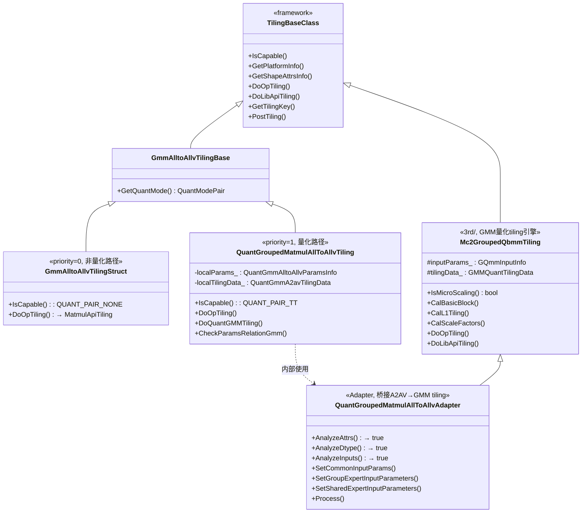
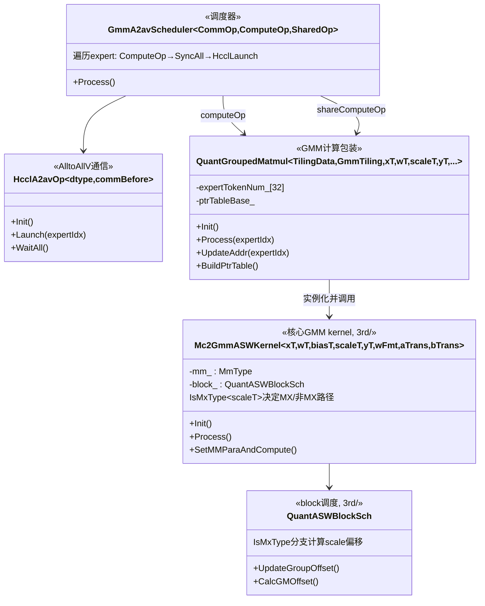

# GMM AlltoAllV MX量化 Tiling/Kernel 架构详设

## 1. 目标与规格

在 `grouped_mat_mul_allto_allv` 算子中新增 MXFP8 量化模式（mode=6），复用 GMM 算子已有的 MX 量化能力。

| 项目 | 规格 |
|------|------|
| 输入数据类型 | `float8_e4m3fn` / `float8_e5m2` (gmmX/gmmWeight, mmX/mmWeight) ND格式 |
| 类型约束 | gmmX 与 mmX 类型一致，gmmWeight 与 mmWeight 类型一致，x/weight 可不同 |
| Scale数据类型 | `float8_e8m0` |
| 输出数据类型 | `float16`, `bfloat16` |
| 量化模式 | MX量化 (QuantizationMode = 6, 内部映射 MX_PERGROUP_MODE = 0x8) |
| 转置 | GMM/共享专家MM 均支持 true/false |
| 卡数 | 2, 4, 8, 16, 32, 64, 128, 256 |

## 2. 当前架构核心类

### 2.1 Tiling 层类图



### 2.2 Kernel 层类图



### 2.3 已有 MX 能力映射

| 组件 | MX 支持 | 说明 |
|------|---------|------|
| `Mc2GroupedQbmmTiling` (3rd) | **已有** | `IsMicroScaling()`, `CalScaleFactors()`, `mxTypePara` |
| `Mc2GmmASWKernel` (3rd) | **已有** | `IsMxType<scaleType>()` 全路径覆盖 |
| `QuantASWBlockSch` (3rd) | **已有** | MX scale offset 计算 |
| `QuantGroupedMatmulAllToAllvTiling` | **未有** | `IsCapable()` 仅放行 TT |
| `QuantGroupedMatmulAllToAllvAdapter` | **未有** | quant mode 映射公式对 MX 不正确 |
| `grouped_mat_mul_allto_allv_apt.cpp` | **未有** | `scaleType` 硬编码 `float` |
| `QuantGroupedMatmul` | **未有** | MX scale 偏移未处理 |
| TilingKey | **未有** | 无 `QUANT_MODE_MX` |

## 3. 改动方案

### 3.1 Tiling 层

#### 3.1.1 `grouped_mat_mul_allto_allv_tiling_base.h/.cpp`

`QuantModePair` 枚举新增 `QUANT_PAIR_MX = 6`（与 aclnn 层 `QuantizationMode::QUANT_MX = 6` 保持一致）。

`GetQuantMode()` 新增分支：当 `gmmXQuantMode == QUANT_MX && gmmWeightQuantMode == QUANT_MX` 时返回 `QUANT_PAIR_MX`。

#### 3.1.2 `arch35/quant_grouped_mat_mul_allto_allv_tiling.cpp`

**dtype 白名单扩展**：`QUANT_GMM_X_DTYPE_LIST` 和 `QUANT_GMM_WEIGHT_DTYPE_LIST` 新增 `DT_FLOAT8_E4M3FN`、`DT_FLOAT8_E5M2`；`QUANT_GMM_X_SCALE_DTYPE_LIST` 和 `QUANT_GMM_WEIGHT_SCALE_DTYPE_LIST` 新增 `DT_FLOAT8_E8M0`。

**`IsCapable()`**：放行 `QUANT_PAIR_MX`。

**`CheckAndSetLocalParamsGmm()`**：放宽 dtype 检查，从硬编码 `DT_HIFLOAT8` 改为查表。记录 `gmmKSize`（从 weight shape 提取 K 维度）。

**`CheckParamsRelationGmm()`**：新增 MX 分支——校验 scale dtype 为 `DT_FLOAT8_E8M0`，weight scale 形状 `(ep, N, ceil(K/64), 2)` (4D)，x scale 形状 `(A, ceil(K/64), 2)` (3D)，设置 `gmmQuantSuit = QUANT_PAIR_MX`（值 6）。

**`CheckParamsRelationMm()`**：同理新增 MX 分支，校验共享专家 scale 形状。

**`QuantGmmAlltoAllvParamsInfo`**：新增 `gmmKSize`、`mmKSize` 字段。

**`GetTilingKey()`**：将 `QUANT_PAIR_MX`（值 6）编码为 `QUANT_MODE_MX`（tiling key 中值 6）传入 tiling key。

#### 3.1.3 `arch35/quant_grouped_mat_mul_allto_allv_tiling_adapter.cpp`

**quant mode 映射修正**：现有 `1 << (mode - 1)` 公式对 `QUANT_MX=6` 会错误映射到 `PERBLOCK_MODE=32`。改为显式映射：

```cpp
static QuantMode MapQuantMode(int64_t externalMode) {
    switch (externalMode) {
        case QUANT_PERTENSOR: return QuantMode::PERTENSOR_MODE;   // 1 → 0x1
        case QUANT_MX:        return QuantMode::MX_PERGROUP_MODE; // 6 → 0x8
        default:              return QuantMode::DEFAULT;
    }
}
```

**dtype 设置**：MX 模式下 `inputParams_.aDtype`/`bDtype` 使用实际 FP8 类型，`inputParams_.scaleDtype` 和 `perTokenScaleDtype` 设为 `DT_FLOAT8_E8M0`——这是 `Mc2GroupedQbmmTiling::IsMicroScaling()` 返回 true 的前提。

### 3.2 Kernel 层

#### 3.2.1 `op_kernel/grouped_mat_mul_allto_allv_tiling_key.h`

新增 `QUANT_MODE_MX = 2`。在 `ASCENDC_TPL_UINT_DECL` 中注册 `QUANT_MODE_MX`。新增场景 19-28 覆盖 MX 量化的所有 有/无共享专家 x 转置/不转置 组合。

#### 3.2.2 `op_kernel/grouped_mat_mul_allto_allv_apt.cpp`

根据 `TILINGKEY_GMM_QUANT_MODE` 编译期选择 `scaleType`：

```cpp
using GmmScaleType = typename AscendC::Conditional<
    TILINGKEY_GMM_QUANT_MODE == QUANT_MODE_MX,
    AscendC::fp8_e8m0_t, float>::type;

using SharedMmScaleType = typename AscendC::Conditional<
    TILINGKEY_SHARED_MM_QUANT_MODE == QUANT_MODE_MX,
    AscendC::fp8_e8m0_t, float>::type;
```

将所有 `Mc2GmmASWKernel`、`QuantGroupedMatmul` 实例化中的 `float` scaleType 替换为上述条件类型。`scaleType = fp8_e8m0_t` 时 `IsMxType<scaleType>()` 为 true，自动激活 3rd 层所有 MX 路径。

#### 3.2.3 `mc2_templates/compute/quant_grouped_matmul.h`

**`UpdateAddr()`**：MX 模式下按 `(M, ceil(K/64), 2)` / `(ep, N, ceil(K/64), 2)` 布局计算 xScale/wScale 的 per-expert GM 偏移。非 MX 模式（scalar scale）偏移逻辑不变。新增 `xScaleAddr_`、`wScaleAddr_` 成员变量。

**`Process()`**：使用计算后的 `xScaleAddr_`/`wScaleAddr_` 构建 ptrTable 和传递 perTokenScale 地址。

### 3.3 无需修改的组件

| 组件 | 原因 |
|------|------|
| `Mc2GroupedQbmmTiling` (3rd) | 已完整支持 MX，被 Adapter 透明复用 |
| `Mc2GmmASWKernel` (3rd) | `IsMxType<scaleType>()` 编译期分支，scaleType 变更后自动激活 |
| `QuantASWBlockSch` (3rd) | MX offset 计算已有 |
| `HcclA2avOp` | 通信层不感知量化模式 |
| `GmmA2avScheduler` | 调度层不感知量化模式 |
| `QuantGmmA2avTilingData` | `GMMQuantParams.aQuantMode/bQuantMode` 字段已能表达 MX |

## 4. 文件修改清单

| 文件 | 改动 |
|------|------|
| `op_host/op_tiling/grouped_mat_mul_allto_allv_tiling_base.h` | 枚举 `QUANT_PAIR_MX` |
| `op_host/op_tiling/grouped_mat_mul_allto_allv_tiling_base.cpp` | `GetQuantMode()` MX 分支 |
| `arch35/quant_grouped_mat_mul_allto_allv_tiling.h` | `QuantGmmAlltoAllvParamsInfo` 新增字段 |
| `arch35/quant_grouped_mat_mul_allto_allv_tiling.cpp` | dtype 白名单、`IsCapable`、dtype 检查放宽、MX scale 形状校验、tiling key 编码 |
| `arch35/quant_grouped_mat_mul_allto_allv_tiling_adapter.cpp` | `MapQuantMode()`、MX dtype 设置 |
| `op_kernel/grouped_mat_mul_allto_allv_tiling_key.h` | `QUANT_MODE_MX`、新场景 |
| `op_kernel/grouped_mat_mul_allto_allv_apt.cpp` | scaleType 编译期选择 |
| `mc2_templates/compute/quant_grouped_matmul.h` | MX scale 偏移、地址传递 |

## 5. 注意事项

1. **Adapter quant mode 映射 bug**：现有 `1 << (mode - 1)` 对 `QUANT_MX=6` 映射为 `0x20=PERBLOCK_MODE` 而非 `0x8=MX_PERGROUP_MODE`。当前不影响（仅 TT 进入），但 MX 适配必须修正为显式映射。

2. **3rd 目录代码同步**：`mc2/3rd/grouped_matmul/` 是从 `gmm/grouped_matmul/` 拷贝的子集。实现前需 diff 关键文件（`gqmm_cube_on_the_fly.h`、`quant_block_sch.h`、`gmm_qbmm_tiling.h/.cpp`）确认 MX 支持完整。

3. **共享专家量化模式独立性**：共享专家 MM 的量化模式与 GMM 独立。需确认共享专家是否也使用 MX，还是可能出现 GMM=MX + SharedMM=TT 的混合场景。当前 tiling key 设计已支持混合。

4. **编译期模板实例化**：MX 新增约 8 种 xType x yType x bTrans 组合（`fp8_e4m3fn`/`fp8_e5m2` x `half`/`bfloat16` x `true`/`false`），叠加有/无共享专家，总计约 20 个新 kernel binary。需关注编译产物大小。
