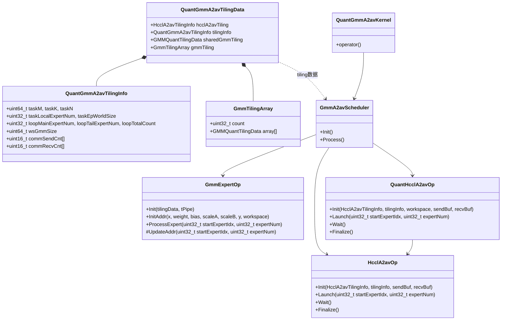

# Quant Grouped MatMul AlltoAllV 融合算子 Kernel 架构设计

## 1. 概述

本文档描述 `quant_grouped_mat_mul_allto_allv` 量化融合算子的 Kernel 架构设计。该算子融合了 `GmmASWKernel`（Grouped MatMul with Adaptive Sliding Window）和 HCCL AlltoAllV 通信接口。

### 1.1 场景描述
- **输入 X**: 二维张量，在 M 轴切分（按专家）
- **输入 Weight**: 三维张量，第一个维度是 expert
- **量化模式**: HiF8 (fp8_e4m3) pertensor-pertensor
- **计算流程**: 按专家切块计算，计算完后发送出去

### 1.2 核心分工

| Core Type         | Responsibility                    |
| ----------------- | --------------------------------- |
| **AIC & AIV**     | GMM matrix multiplication compute |
| **AIV (block 0)** | HCCL communication operations     |

---

## 2. Pipeline 编排

### 2.1 Pipeline Timeline (Multiple Experts per Loop)


```
Time ─────────────────────────────────────────────────────────────────────────────────────>

Loop 0:    |==GMM E0==|==GMM E1==|Sync|
Comm 0:                               [---A2AV E0---][---A2AV E1---]

Loop 1:                               |==GMM E2==|==GMM E3==|Sync|
Comm 1:                                                          [---A2AV E2---][---A2AV E3---]

Loop 2:                                                          |==GMM E4==|Sync| (tail)
Comm 2:                                                                          [---A2AV E4---]

Wait:                                                                                            |==Wait All==|
```

**Configurable via `ComputeCommLoopInfo`:**
- `mainLoopExpertNum`: Number of experts per main loop iteration
- `tailLoopExpertNum`: Number of experts in the last loop iteration
- `totalLoopCount`: Total number of loop iterations

### 2.2 Data Flow Diagram

```
                    ┌─────────────────────────────────────────────────────────────┐
                    │                        Rank i                               │
                    │  ┌──────────────────────────────────────────────────────┐   │
                    │  │                     Workspace                        │   │
                    │  │  ┌─────────┐  ┌─────────┐  ┌─────────┐               │   │
Input X ──────────► │  │  │GMM Out  │  │GMM Out  │  │GMM Out  │   ...         │   │
(M-axis split)      │  │  │Expert 0 │  │Expert 1 │  │Expert 2 │               │   │
                    │  │  └────┬────┘  └────┬────┘  └────┬────┘               │   │
Weight ────────────►│  │       │            │            │                    │   │
(3D: E x K x N)     │  │       ▼            ▼            ▼                    │   │
                    │  │  ┌─────────────────────────────────────────────────┐ │   │
                    │  │  │              AlltoAllV Communication            │ │   │
                    │  │  │  Send to other ranks based on expert routing    │ │   │
                    │  │  └─────────────────────────────────────────────────┘ │   │
                    │  └──────────────────────────────────────────────────────┘   │
                    └─────────────────────────────────────────────────────────────┘
                                               │
                                               ▼
                    ┌─────────────────────────────────────────────────────────────┐
                    │                     Output Y                                │
                    │         (Received from all ranks, sorted by expert)         │
                    └─────────────────────────────────────────────────────────────┘
```

---

## 3. 类图



---

## 4. TilingKey 设计

### 3.1 使用 ASCENDC_TPL_ARGS_DECL 宏定义

```cpp
/**
 * TilingKey 定义
 * 使用 ASCENDC_TPL_ARGS_DECL 宏实现 TilingKey 到模板参数的自动转换
 */
ASCENDC_TPL_ARGS_DECL(
    QuantGroupedMatMulAlltoAllv,
    
    // TODO x weight shared_expX, weight是否需要模板化 owner: 丁伟
    // GMM 数据类型
    ASCENDC_TPL_DTYPE_DECL(
        TILINGKEY_GMM_X_DTYPE, GMM_TPL_FLOAT16, GMM_TPL_BF16, GMM_TPL_INT8, GMM_TPL_FP8),
    ASCENDC_TPL_DTYPE_DECL(
        TILINGKEY_GMM_W_DTYPE, GMM_TPL_FLOAT16, GMM_TPL_BF16, GMM_TPL_INT8, GMM_TPL_INT4, GMM_TPL_FP8),
    
    // 共享专家数据类型
    ASCENDC_TPL_DTYPE_DECL(
        TILINGKEY_SHARED_X_DTYPE, GMM_TPL_FLOAT16, GMM_TPL_BF16, GMM_TPL_INT8, GMM_TPL_FP8),
    ASCENDC_TPL_DTYPE_DECL(
        TILINGKEY_SHARED_W_DTYPE, GMM_TPL_FLOAT16, GMM_TPL_BF16, GMM_TPL_INT8, GMM_TPL_INT4, GMM_TPL_FP8),

    // GMM 计算转置场景
    ASCENDC_TPL_BOOL_DECL(
        TILINGKEY_GMM_WEIGHT_TRANS, 0, 1),
    
    // 共享专家 MM 计算转置场景
    ASCENDC_TPL_BOOL_DECL(
        TILINGKEY_SHARED_MM_WEIGHT_TRANS, 0, 1),
    
    // 通信量化模式：0=不量化, 1=INT8, 2=INT4
    // TODO owner: 丁伟
    ASCENDC_TPL_UINT_DECL(
        TILINGKEY_COMM_QUANT_MODE, ASCENDC_TPL_2_BW, ASCENDC_TPL_UI_LIST, 0, 1, 2),
    
    // GMM 量化模式：0=NONE, 1=TT(perTensor-perTensor)
    // TODO 量化模式不清楚, owner: 丁伟
    ASCENDC_TPL_UINT_DECL(
        TILINGKEY_GMM_QUANT_MODE, ASCENDC_TPL_4_BW, ASCENDC_TPL_UI_LIST, 0, 1, 2, 3, 4, 5, 6),
    
    // 共享专家 MM 量化模式
    ASCENDC_TPL_UINT_DECL(
        TILINGKEY_SHARED_MM_QUANT_MODE, ASCENDC_TPL_4_BW, ASCENDC_TPL_UI_LIST, 0, 1, 2, 3, 4, 5, 6),
);
```

### 3.2 数据类型宏定义说明

为了保持与 `GroupedMatmul` 算子的一致性，建议复用或定义以下数据类型宏：

```cpp
#define GMM_TPL_FLOAT   0
#define GMM_TPL_FLOAT16 1
#define GMM_TPL_INT8    2
#define GMM_TPL_INT32   3
#define GMM_TPL_BF16    27
#define GMM_TPL_FP8     28 // 对应 DT_FLOAT8_E4M3FN
#define GMM_TPL_INT4    29
```

---


---

## 5. TilingData 结构设计

### 4.1 复用现有结构

```cpp
// 复用 GMM kernel 的 tiling 结构
using GMMQuantTilingData = GroupedMatmulTilingData::GMMQuantTilingData;
using GMMQuantParams = GroupedMatmulTilingData::GMMQuantParams;
using GMMArray = GroupedMatmulTilingData::GMMArray;

constexpr uint32_t MAX_EXPERT_PER_EP = 32U;
constexpr uint32_t MAX_EP_RANK_SIZE = 256U;
```

### 4.2 QuantGmmA2avTilingInfo 结构体（扁平化核心配置）

```cpp
/**
 * QuantGmmA2avTilingInfo 核心配置信息
 * 合并了任务维度、流水线切分、Workspace 大小以及通信计数
 * 通过命名前缀区分逻辑分组：task, loop, ws, comm
 */
struct QuantGmmA2avTilingInfo {
    // --- Task Info (任务维度与专家信息) ---
    uint64_t taskM;                                 // 总 M 维度
    uint64_t taskK;                                 // K 维度
    uint64_t taskN;                                 // N 维度
    uint32_t taskLocalExpertNum;                    // 本 EP 专家数
    uint32_t taskEpWorldSize;                       // EP 通信域大小
    
    // --- Loop Info (通算融合流水线切分信息) ---
    uint32_t loopMainExpertNum;                     // 主块：每次 loop 处理几个专家
    uint32_t loopTailExpertNum;                     // 尾块：最后一次 loop 处理几个专家
    uint32_t loopTotalCount;                        // 总 loop 次数

    // --- Workspace Info (Workspace 大小) ---
    uint64_t wsGmmSize;                             // GMM workspace 大小

    // --- Comm Info (通信计数数组) ---
    // 每专家发送到各 rank 的 token 数
    uint16_t commSendCnt[MAX_EXPERT_PER_EP * MAX_EP_RANK_SIZE];
    // 从各 rank 接收每专家的 token 数
    uint16_t commRecvCnt[MAX_EXPERT_PER_EP * MAX_EP_RANK_SIZE];
};
```

### 4.3 HCCL AlltoAllV Tiling 封装

```cpp
/**
 * HCCL AlltoAllV Tiling 封装
 */
struct HcclA2avTilingInfo {
    Mc2InitTiling initTiling;          // HCCL 初始化配置
    Mc2CcTiling a2avCcTiling;          // AlltoAllV CC 配置
};
```

### 4.4 GMM Tiling 数组封装

```cpp
/**
 * GMM Tiling 数组封装
 */
struct GmmTilingArray {
    uint32_t count;                             // 实际使用的 tiling 数量
    GMMQuantTilingData array[MAX_EXPERT_PER_EP];
};
```

### 4.5 完整 TilingData 结构

```cpp
/**
 * 完整 TilingData 结构
 *
 * 设计要点：
 *   1. 共享专家放在普通专家之前
 *   2. GMM Tiling 数组和 count 封装在一起
 *   3. QuantGmmA2avTilingInfo 包含扁平化的核心配置（Task/Loop/Workspace/Comm）
 */
struct QuantGmmA2avTilingData {
    // ============ HCCL AlltoAllV Tiling ============
    HcclA2avTilingInfo hcclA2avTiling;
    
    // ============ 核心配置信息 (Task/Loop/Workspace/Comm) ============
    QuantGmmA2avTilingInfo tilingInfo;
    
    // ============ 共享专家 GMM Tiling（放在前面）============
    GMMQuantTilingData sharedGmmTiling;
    
    // ============ 普通专家 GMM Tiling 数组 ============
    GmmTilingArray gmmTiling;
};
```

---

## 6. 头文件设计

### 5.1 HcclA2avOp 类

```cpp
// hccl_a2av_op.h

#ifndef HCCL_A2AV_OP_H
#define HCCL_A2AV_OP_H

#include "kernel_operator.h"

namespace AscendC {

/**
 * HCCL AlltoAllV 操作封装类
 * 内部硬编码使用 AIV block 0 执行通信操作
 *
 * @tparam DataType     通信数据类型
 */
template <typename DataType>
class HcclA2avOp {
public:
    __aicore__ inline HcclA2avOp();
    
    /**
     * 初始化
     * @param a2avTiling  HCCL AlltoAllV Tiling 信息
     * @param tilingInfo  扁平化的核心配置信息（包含通信计数）
     * @param sendBuf     发送缓冲区基地址
     * @param recvBuf     接收缓冲区基地址
     */
    __aicore__ inline void Init(
        const HcclA2avTilingInfo* a2avTiling,
        const QuantGmmA2avTilingInfo* tilingInfo,
        GM_ADDR sendBuf, GM_ADDR recvBuf);
    
    /**
     * 启动通信任务（同步启动接口，内部处理 Prepare/Commit）
     * @param startExpertIdx  起始专家索引
     * @param expertNum       专家数量
     */
    __aicore__ inline void Launch(uint32_t startExpertIdx, uint32_t expertNum);
    
    /**
     * 等待所有已启动的通信任务完成
     */
    __aicore__ inline void Wait();
    
    __aicore__ inline void Finalize();

private:
};

} // namespace AscendC
#endif
```

### 5.2 QuantHcclA2avOp 类

```cpp
// quant_hccl_a2av_op.h

#ifndef QUANT_HCCL_A2AV_OP_H
#define QUANT_HCCL_A2AV_OP_H

#include "hccl_a2av_op.h"

namespace AscendC {

/**
 * 带量化的 HCCL AlltoAllV 操作（鸭子类型）
 * 通信前量化，通信后反量化
 * 内部硬编码使用 AIV block 0 执行通信与量化操作
 *
 * @tparam InputType    输入数据类型
 * @tparam CommType     通信数据类型（量化后）
 */
template <typename InputType, typename CommType = int8_t>
class QuantHcclA2avOp {
public:
    __aicore__ inline QuantHcclA2avOp();
    
    /**
     * 初始化
     * @param a2avTiling   HCCL AlltoAllV Tiling 信息
     * @param tilingInfo   扁平化的核心配置信息（包含 Workspace 大小与通信计数）
     * @param workspace    Workspace 基地址
     * @param sendBuf      发送缓冲区基地址（GMM 输出）
     * @param recvBuf      接收缓冲区基地址（最终输出）
     */
    __aicore__ inline void Init(
        const HcclA2avTilingInfo* a2avTiling,
        const QuantGmmA2avTilingInfo* tilingInfo,
        GM_ADDR workspace,
        GM_ADDR sendBuf, GM_ADDR recvBuf);
    
    /**
     * 启动带量化的通信任务
     * @param startExpertIdx  起始专家索引
     * @param expertNum       专家数量
     */
    __aicore__ inline void Launch(uint32_t startExpertIdx, uint32_t expertNum);
    
    /**
     * 等待所有已启动的通信任务完成
     */
    __aicore__ inline void Wait();
    
    __aicore__ inline void Finalize();

private:
};

} // namespace AscendC
#endif
```

### 5.3 GmmExpertOp 类

```cpp
// gmm_expert_op.h

#ifndef GMM_EXPERT_OP_H
#define GMM_EXPERT_OP_H

#include "kernel_operator.h"
#include "arch35/quant_adaptive_sliding_window_templates/gqmm_cube_on_the_fly.h"

namespace AscendC {

/**
 * GMM 专家计算操作封装
 * 在 GmmASWKernel 之上封装按专家拆解的计算逻辑
 */
template <typename xType, typename wType, typename biasType,
          typename yType, typename scaleType,
          CubeFormat wFormat = CubeFormat::ND,
          bool aTrans = false, bool bTrans = false>
class GmmExpertOp {
public:
    using GmmKernelType = GmmASWKernel<xType, wType, biasType, scaleType, yType, wFormat, aTrans, bTrans>;
    
    __aicore__ inline GmmExpertOp();
    
    /**
     * 初始化
     * @param tilingData  算子 Tiling 数据
     * @param tPipe       Pipe 指针
     */
    __aicore__ inline void Init(const QuantGmmA2avTilingData* tilingData, TPipe* tPipe);
    
    /**
     * 初始化所有输入输出的基地址
     * groupList 将在内部根据 sendCounts 自动计算，无需外部传入
     */
    __aicore__ inline void InitAddr(
        GM_ADDR x, GM_ADDR weight, GM_ADDR bias,
        GM_ADDR scaleA, GM_ADDR scaleB,
        GM_ADDR y, GM_ADDR workspace);
    
    /**
     * 处理专家计算（内部自动调用 UpdateAddr 更新地址）
     * @param startExpertIdx  起始专家索引
     * @param expertNum       专家数量
     */
    __aicore__ inline void ProcessExpert(uint32_t startExpertIdx, uint32_t expertNum);

protected:
    /**
     * 内部计算并更新 x 和 y 的起始地址，同时计算 groupList
     * @param startExpertIdx  起始专家索引
     * @param expertNum       本次处理的专家数量
     */
    __aicore__ inline void UpdateAddr(uint32_t startExpertIdx, uint32_t expertNum);

private:
    GmmKernelType gmmKernel_;
    const QuantGmmA2avTilingData* tilingData_;
    TPipe* tPipe_;
    
    GM_ADDR xBase_;
    GM_ADDR weightBase_;
    GM_ADDR biasBase_;
    GM_ADDR scaleABase_;
    GM_ADDR scaleBBase_;
    GM_ADDR groupListBase_; // 内部计算并存储在 workspace 中
    GM_ADDR yBase_;
    GM_ADDR workspaceBase_;
};

} // namespace AscendC
#endif
```

### 5.4 GmmA2avScheduler 类

```cpp
// gmm_a2av_scheduler.h

#ifndef GMM_A2AV_SCHEDULER_H
#define GMM_A2AV_SCHEDULER_H

#include "gmm_expert_op.h"
#include "hccl_a2av_op.h"

namespace AscendC {

/**
 * GMM + AlltoAllV 调度器
 */
template <typename GmmExpertOpType, typename HcclOpType>
class GmmA2avScheduler {
public:
    __aicore__ inline GmmA2avScheduler();
    
    __aicore__ inline void Init();
    
    __aicore__ inline void Process();

protected:
    TPipe* tPipe_;
};

} // namespace AscendC
#endif
```

---

## 7. 顶层 Kernel 入口

```cpp
// quant_gmm_a2av_kernel.h

#ifndef QUANT_GMM_A2AV_KERNEL_H
#define QUANT_GMM_A2AV_KERNEL_H

#include "gmm_expert_op.h"
#include "hccl_a2av_op.h"
#include "quant_hccl_a2av_op.h"
#include "gmm_a2av_scheduler.h"

namespace AscendC {

/**
 * 量化 GMM AlltoAllV 融合算子
 */
class QuantGmmA2avKernel {
public:
    __aicore__ inline QuantGmmA2avKernel();
    
    __aicore__ inline void Init();
    
    __aicore__ inline void Process();
};

} // namespace AscendC
#endif
```

---